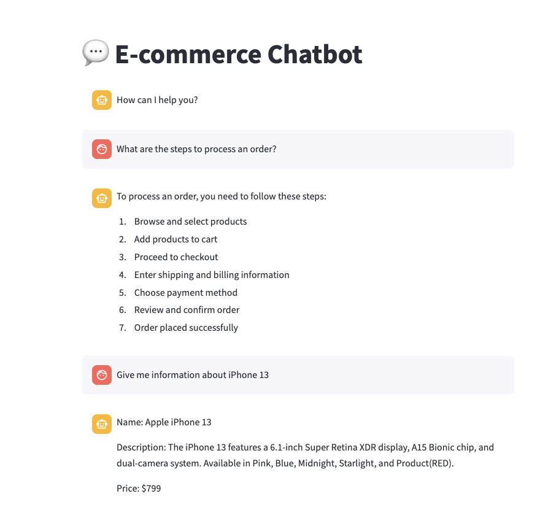
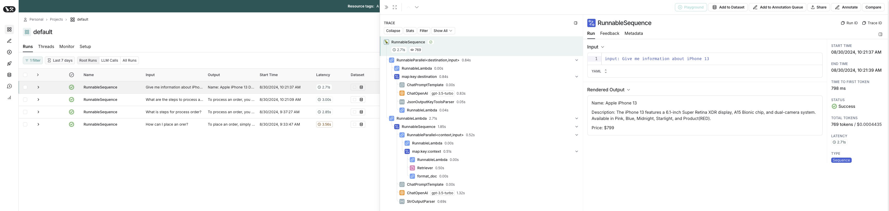

# E-commerce Platform Chatbot

A chatbot system that can handle common customer support queries and provide relevant responses for an e-commerce platform.

## Techstack:

- Model: OpenAI gpt-3.5-turbo
- Application UI: Streamlit
- Python
- LangChain: Prompt Templates, Chains, Parsers, RAG
- LangSmith: https://www.langchain.com/langsmith

## Requirements:

Refer this [session](https://docs.google.com/document/d/128riPnaGP3CMqBmHc5SmYb5gpBnt_Zr7ue_PEwf28u0/edit#heading=h.gssp6ohs7zqb) for more information.

## Getting started:

Step by step to run the chatbot on local

1. Clone the project repository and go to directory

```shell
$ git clone git@github.com:trungnguyentrong-agilityio/generative-ai-training.git
$ cd generative-ai-training/e-commerce-chatbot
```

2. Create python virtual environment then activate

```shell
$ python -m venv venv
$ source venv/bin/activate
```

3. Install project dependencies

```shell
$ pip install -r requirements.txt
```

4. Setup environment variables
    - Quickly create `.env` file
        ```shell
        $ cp .sample.env .env
        ```
    - Provide values for required env in created file

5. Before running the chatbot UI, you need to load the knowledge base documentation

```shell
$ make load_document
```

6. Start the streamlit chatbot UI

```shell
$ make run_app
```

## Achievements

1. Prompt some questions for E-commerce chatbot



2. LangSmith tracing

